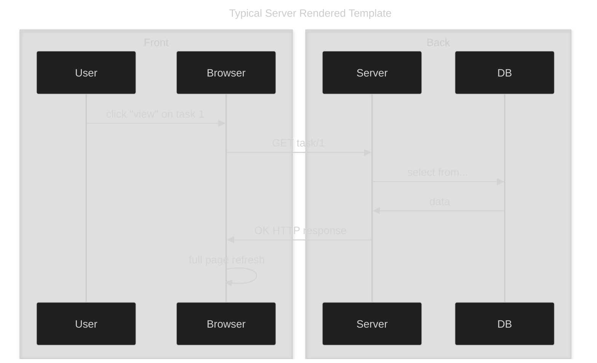
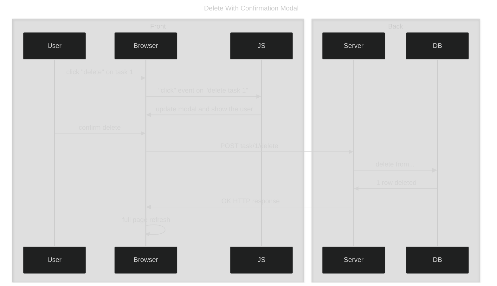
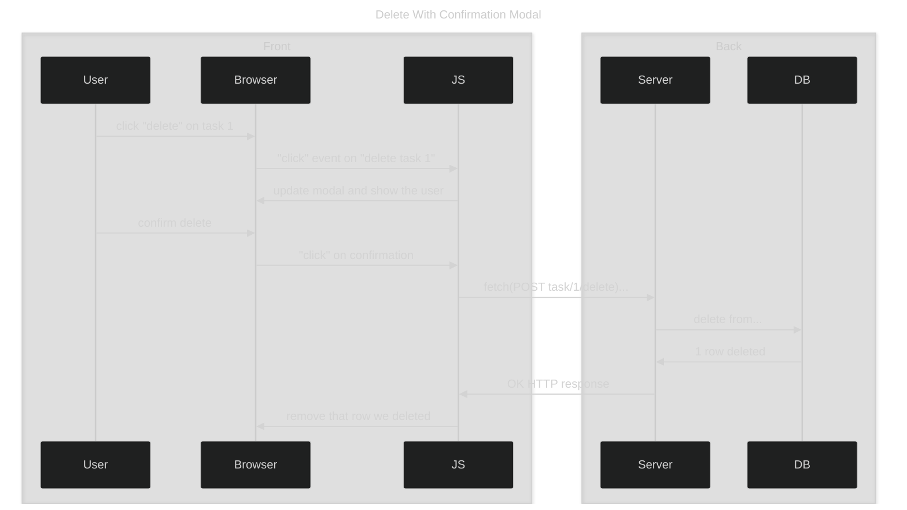

Continuing [this todo project](), I thought it would be a good time to dip into a little JS. So far the site was built entirely with Django server rendered templates. To get started with some progressive enhancements I picked out a few changes I could make on the frontend with JS without needing to update the Django views or create API endpoints yet.

## Final product

Here's a gif after the changes. You'll notice that delete buttons now open a modal in a few cases. What might be trickier to see in the gif is that deleting items from a list now happens without a full page refresh.

## Background

Most of the views set up for this project follow the typical flow for server rendered templates in Django - everything goes through the server, and the server sends back a completely updated, rendered HTML page.

Keeping all that logic on the server can be nice, it means you don't have to worry about state and keeping the frontend in sync with the backend. The downside is that navigating to lots of pages to work with the website can be annoying. Inlining things can help, like the comment delete functionality from [the previous post]() used a form to submit a post request directly when deleting a comment rather than rendering out a separate view, but it still ends up in a full page refresh after deleting the comment.

To enhance this a bit I added some new code, including AJAX requests. I added a modal on the base html template that gets re-used in different contexts by showing/hiding the overlap and attaching different event listeners to the modal buttons.  Here's the first set of changes...

1) Added JS event listeners to trigger a modal for task deletion in the detail view (no AJAX)
2) AJAX request to delete tasks from the task list on the homepage
3) AJAX request to delete comments from the comments list on the task detail view

In the first case I wanted to redirect the user back to the homepage after deleting a task from the detail view. The existing delete view already handles that, so instead of sending the form through an AJAX request the JS code just submits the form.

In the second and third cases the implementation was similar, just using the modal helper functions to capture button presses and delete parent list items. The tricky part of this with using fetch alone is that I needed to handle state imperatively rather than declaratively (like React). After I submit a request to the "delete" endpoint, and confirm that request succeeded, I need to *manually* remove the list item from the page to match the state to the server.

I think this was a part of the javascript world I never had a firm grasp on. One of the big issues those frontend frameworks fill is how to avoid needing to do that kind of imperative work to manage state by hand. In a complex site I would image that could get very tricky.

There was one part of this flow I had trouble understanding a first, how does is the JS request authenticated? The fetch request I sent to the delete endpoint only had the ID of the task to delete, a CSRF token for security, and a content-type of application/json. There are two things going on that make this work.

1) Django's Session middleware: responses send a cookie including the domain and a session ID that can be linked back to a user (or anonymous user) on the server side.
2) Browsers have a default functionality to include cookies from the same domain in subsequent requests. So when I submitted that fetch request to the server, my browser sent along the relevant cookie by default and the server used that to authenticate the request.

And that's it for now! This was a tiny addition but fun chance to learn how a few more pieces fit together. Rubber ducking some of this info with LLM chats has been eye opening, it feels like a new way to learn. Excited to see where it goes next.
