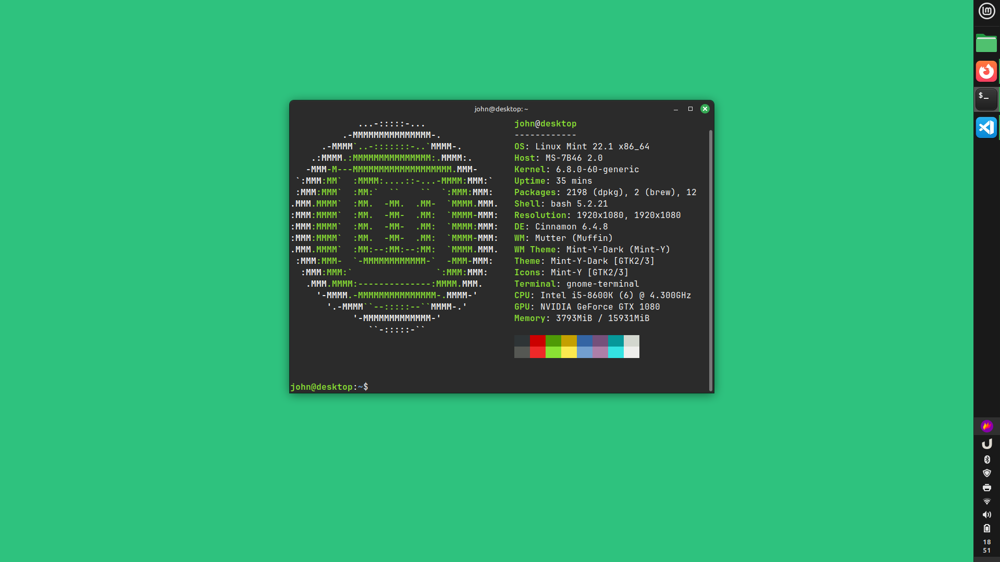

I've been tinkering around with Linux Mint at home for a few weeks now and decided to write a quick update on how it has been going so far. I decided to update my home computer to dual boot into Linux Mint and Win11 after getting annoyed with the Microsoft pushing onedrive and the m365 accounts on bootup. I did still keep the windows partition active as a fallback, particularly for software compatiblity if I don't want to fuss with wine.

Right now I have 2x500GB SSDs in my home desktop with larger storage on a separate NAS, so I set up the dual boot to give both partitions one of the 500GB SSDs. Here's more specs below if you're interested. This is a desktop I built in 2016 so getting close to 10 years old!  

- CPU: i5-8600k
- GPU: GTX 1080
- RAM: 16GB
- Mobo: MSI Z370 sLI Plus
- OS: Linux Mint 22.1
- Desktop Environment: Cinnamon

## First Impressions

Booting is fast. I feel like I got used to fast boots after first switching over to SSDs everywhere but even still swapping to the Mint partition felt like a noticable speedup. Getting the system configured was pretty easy, which I believe is supposed to be one of the benefits of Mint/Ubuntu type distros. I did need to make sure certain drivers got updated and reboot a couple times after updates (particularly my wifi card?), but ultimately the process was straight forward.

For personalization I usually go pretty light, I always set my background to a solid color (usually green), dock the home bar against the right edge of the screen, increase the pointer size and remove any desktop icons.

## Getting started with the shell

I was familiar enough with the shell to get started navigating around, installing and updating software. I'm more familiar with Powershell from working on Windows and doing a bit of python coding, but no major gripes. One thing I have picked up is how to dig around to find relevant programs and get relevant info on how to use them.

- `man`: man pages are the first thing people point to. I've found some of these are more instructive than others but they are a good resource.
- `apropos`: this one is great, `apropos <search term>` will do a quick search to give you program names and one line descriptions for any programs that match your keyword search. I guess that's the saying of "does one thing and does it well"
- `tldr`: this is one that I had not heard of before but I absolutely love it. [tldr](https://github.com/tldr-pages/tldr) is a community run version of short, example driven versions of man pages. This one really helps cut through the noise and seeing examples first often helps me figure out if I'm in the right place or need to look elsewhere
- `llm`: Simon willison's llm python package is a cool way to interact with an llm model as a cli program, including a chat mode. I use this with a local model through GPT4All (currently running mistral-7b-instruct-v0). I haven't dove into the "vibe coding" as much yet but using the chat to probe my understanding of topics has been fun. There is something about not needing to context switch by navigating to different web pages for info that makes the llm chat feel more dynamic.

So my workflow looks something like ...

- search about ideas on what to do online or with `llm`. These often come from a few youtubers I follow
- Take a look at documentation online if I need to see how to install something, or search `apt`
- `tldr` as a first peek at how a cli tool is used, then `man` pages or `--help` on commands as needed to get what I need.

## Bonus: The Reboot Mystery

One nagging issue I had with my Mint partition was that when I would go to reboot the system the screen would get half full of noise and the system would freeze. Only a hard power cycle would pull it out.

Suspending and full power cycles worked fine, it was only reboots that caused an issue for some reason. This was beyond my knowledge so I decided to get some info together and submit a cry for help on the mint forums. I was about to get some info together to post when I saw in the diagnostics my BIOS was from 2017 😅. That seemed like it would be the first thing someone asked me to update so I figure I could go ahead and do that ahead of time. Got the new BIOS from the MSI website, jumped out to the BIOS settings and flashed the new BIOS in. The whole process probably took less than 10m, and voila! Reboot mystery solved. The next reboot I got the pleasant mint login screen without any issues. Maybe next time I won't wait most of a decade...
